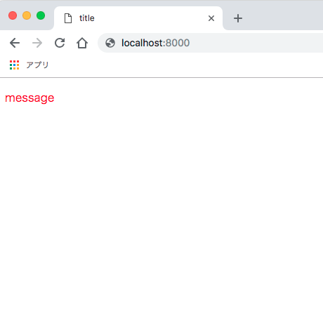
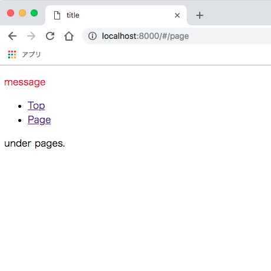

# 実践 - Vue.js SSR

この **実践 - Vue.js SSR** では、`Vue.js` + `Node.js(Express)`でSSR環境を構築していきます。  
自然な開発フローで、必要最低限の実装で進めていきます。  

## ゴール

**SSR環境を構築でき、拡張することができる**

- 極シンプルなSSR環境を構築します
- ジェネレータ的なものは使わず、全体の概要を理解しながら進めていきます

## 大まかな実装の流れ

1. ビルド環境
2. SPA
3. SSR

## 実践

はじめに、Node.jsがインストール済みであるか確認してください。  
ここでは現時点での安定板`v8.12.0`を使用していきます。  

続いて、任意のディレクトリで`npm init -y`を実行して`package.json`を生成しておきます。  

それではいきましょう。  

## 実践1. ビルド環境

`webpack`・`babel`を使用してESNextが書ける環境を構築します。

ビルド対象となるファイルを`src/index.js`として生成しておきましょう。  
確認用にESNextの`const`と`アロー関数`を使用します。  

**src/index.js**

```js
const greet = (message) => {
  console.log(message);
};

greet('Hello');
```

### `webpack`

`webpack`をインストールします。  

```bash
npm i -D webpack webpack-cli
```

`i`は`install`、`-D`は`--save-dev`のエイリアスです。  

続いて設定ファイルを作成します。  

`webpack.config.js`という名前のファイルを作成します。  
これは`webpack`が自動で読み込んでくれる特別な名前です。  

**webpack.config.js**

```js
const path = require('path');

const config = {
  entry: path.join(__dirname, 'src/index.js'),
  output: {
    filename: 'main.js',
    path: path.join(__dirname, 'dist')
  }
};

module.exports = (env, argv) => {
  switch (argv.mode) {
    case 'production':
      // expand config for production
      break;
    case 'development':
    default:
      // expand config for development
      config.devtool = 'inline-source-map';
      break;
  }

  return config;
};
```

`src/index.js`を`main.js`という名前で`dist`ディレクトリにビルドするだけの設定です。  

```js
  entry: path.join(__dirname, 'src/index.js'),
  output: {
    filename: 'main.js',
    path: path.join(__dirname, 'dist')
  }
```

`module.exports`では単にオブジェクトを返すこともできますが、関数を返すことによって実行時の環境（`env`）や引数（`argv`）を受け取ることができ、環境ごとの設定をすることが可能になります。  

```js
module.exports = (env, argv) => {
  // ここで環境ごとの設定をする
  
  // 最後に設定内容を返すことを忘れずに
  return config;
}
```

今回は開発環境でのみソースマップを追加するように設定しています。  

```js
    case 'development':
    default:
      // expand config for development
      config.devtool = 'inline-source-map';
      break;
```

`require('path')`や`__dirname`はNode.jsで使える特別なモジュール・変数です。  
ここでは述べませんが、興味のある方は[Node.jsドキュメント](https://nodejs.org/ja/docs/)を参照してください。  

それでは、一度ビルドを実行してみましょう。  

```bash
npx webpack --mode=development
```

`npx`はローカルにインストールされているnode_modulesを実行できる、`npm`に付随する便利なコマンドです。  

以下のようなメッセージが表示され、`dist/main.js`というファイルが生成されれば成功です。  

```
Hash: c1504f90d90b13c36b96
Version: webpack 4.20.2
Time: 78ms
Built at: 2018-10-09 11:22:46
  Asset      Size  Chunks             Chunk Names
main.js  3.84 KiB    main  [emitted]  main
Entrypoint main = main.js
[./src/index.js] 72 bytes {main} [built]
```

`dist/main.js`を確認してみましょう。  
ファイル下部に以下のような記述が確認できます。  

```js
/***/ "./src/index.js":
/*!**********************!*\
  !*** ./src/index.js ***!
  \**********************/
/*! no static exports found */
/***/ (function(module, exports) {

const greet = (message) => {
  console.log(message);
};

greet('Hello');

/***/ })
```

`const`や`アロー関数`がそのままビルドされているのがわかります。  
まだESNextをコンパイルする設定をしていないため、これで問題ありません。  

今現在のディレクトリ構成を確認しておきます。

```
root
|- /dist
  |- main.js
|- /node_modules
  |- /some_modules
|- /src
  |- index.js
|- package.json
|- package-lock.json
|- webpack.config.js
```

ところで、ちらほら出現している`mode`とは何でしょうか。  

これは`webpack`にビルドの方法を指定するもので、`mode=production`とすれば本番環境に適した形でビルドをしてくれます。  
オプション`mode`を省略した場合、`webpack`は自動で`mode`を`production`に設定し、その旨のWARNINGをコマンドライン上に表示します。  

試しに以下のコマンドの実行して、コマンドライン上の表示やビルド結果を確認してみてください。  

```bash
npx webpack
```

ここまでの実践内容で不明な点があった、また`webpack`についてより詳しく知りたい場合は[公式ガイド](https://webpack.js.org/guides/)を参照してください。  

### `babel`

`babel`を使用してESNextをコンパイルする設定をしていきましょう。  

必要パッケージをインストールします。  

```bash
npm i -D babel-loader @babel/core @babel/preset-env
```

続いて設定ファイル`.babelrc`を作成します。  

**.babelrc**

```json
{
  "presets": [
    [
      "@babel/preset-env",
      {
        "targets": {
          "browsers": ["> 1%", "last 2 versions", "not ie <= 8"]
        }
      }
    ]
  ]
}
```

この設定によって、`browsers`で指定した環境でもJavaScriptが動作するようにコンパイルされます。  
なお、設定値は[vuejs-templates](https://github.com/vuejs-templates)を参照しています。  

次に`webpack`で`babel`を使うように、`webpack.config.js`に追記します。  

**webpack.config.js**

```js
const path = require('path');

const config = {
  entry: path.join(__dirname, 'src/index.js'),
  output: {
    filename: 'main.js',
    path: path.join(__dirname, 'dist')
  },
  
  // ここを追加
  module: {
    rules: [
      {
        test: /\.m?js$/,
        exclude: /node_modules/,
        loader: 'babel-loader'
      }
    ]
  }
};
```

これで拡張子`.mjs`または`js`のビルドには`babel`の設定が適応されます。  

それでは、ビルドを実行してみましょう。  

```bash
npx webpack --mode=development
```

`dist/main.js`のファイル下部を見てみます。  

```js
/***/ "./src/index.js":
/*!**********************!*\
  !*** ./src/index.js ***!
  \**********************/
/*! no static exports found */
/***/ (function(module, exports) {

var greet = function greet(message) {
  console.log(message);
};

greet('Hello');

/***/ })
```

`const`が`var`に、`(message) => { ... }`が`function greet(message) { ... }`に変換されています。  
これでESNextが書ける環境が整いました。  

`babel`の機能や`babel-loader`の設定について、より詳しく知りたい場合は以下を参照してください。  

- [BABELドキュメント](https://babeljs.io/docs/en/index.html)
- [babel-loader on GitHub](https://github.com/babel/babel-loader)

最後に、ビルドコマンドをnpm scriptsに登録しておきましょう。  
`package.json`の`scripts`に以下を追記します。  

**package.json**

```json
{
  ...,
  "scripts": {
    "test": "echo \"Error: no test specified\" && exit 1",
    "build:prod": "webpack -p",
    "build:dev": "webpack --mode=development"
  },
  ...
}
```

npm scriptsでは`npx`なしでもローカルにインストールされたnode_modulesの実行が可能です。  

`webpack`にオプション`-p`を指定すると、自動的に`production`モードに設定され、コード圧縮も実行されます。  

以下のコマンドを実行して、それぞれのビルド結果を確認してみてください。  

```bash
# 本番用
npm run build:prod

# 開発用
npm run build:dev
```

現在のディレクトリ構成は以下のようになっています。

```
root
|- /dist
  |- main.js
|- /node_modules
  |- /some_modules
|- /src
  |- index.js
|- .babelrc
|- package.json
|- package-lock.json
|- webpack.config.js
```

## 実践2. SPA

Vue.jsで簡単なSPAを作っていきます。  

### 単一ファイルコンポーネント

単一ファイルコンポーネント（`.vue`）を使えるようにしていきましょう。  

必要パッケージをインストールします。  

```bash
npm i -S vue
```

```bash
npm i -D vue-loader
```

`vue`はブラウザ上で使用するため、`--save`のエイリアス`-S`でインストールしておきます。

まずはブラウザ上で動かすコードから書いていきます。  

`vue`を動かせるように`index.html`を作ります。  
重要なのはビルド結果の`dist/main.js`を読み込むことと、マウント先となる空div`<div id="app"></div>`を置くことです。  
`dist/main.js`は`DOMContentLoaded`後に走らせるように`script`タグに`defer`属性を追加しておきます。  

**index.html**

```html
<!doctype html>
<html lang="ja">
<head>
  <meta charset="UTF-8">
  <meta name="viewport"
        content="width=device-width, user-scalable=no, initial-scale=1.0, maximum-scale=1.0, minimum-scale=1.0">
  <meta http-equiv="X-UA-Compatible" content="ie=edge">
  <title>title</title>
  <script src="./dist/main.js" defer></script>
</head>
<body>
<div id="app"></div>
</body>
</html>

```

`src/index.js`を`vue`を使用するように変更します。  
マウント先に`#app`を、レンダリングにコンポーネント`App.vue`を指定します。  

**src/index.js**

```js
import Vue from 'vue';
import App from './App.vue';

new Vue({
  el: '#app',
  render: h => h(App)
});
```

コンポーネント`App.vue`を作成します。

**src/App.vue**

```html
<template>
  <p>{{message}}</p>
</template>

<script>
  export default {
    data() {
      return {
        message: 'message'
      }
    }
  }
</script>
```

これでブラウザ上で`vue`を動かす準備は出来ました。  

次に単一ファイルコンポーネントをコンパイルできるように`webpack.config.js`を変更します。  

**webpack.config.js**

```js
const path = require('path');
const VueLoaderPlugin = require('vue-loader/lib/plugin');

const config = {
  entry: path.join(__dirname, 'src/index.js'),
  output: {
    filename: 'main.js',
    path: path.join(__dirname, 'dist')
  },
  module: {
    rules: [
      {
        test: /\.vue$/,
        loader: 'vue-loader'
      },
      {
        test: /\.m?js$/,
        exclude: /node_modules/,
        loader: 'babel-loader'
      }
    ]
  },
  plugins: [
    new VueLoaderPlugin()
  ]
};
```

ビルドして表示してみましょう。  

```bash
npm run build:dev
```

ローカルサーバーを任意の方法で立ち上げてください。  
macOSであれば以下のコマンドが利用できます。  

```bash
# プロジェクトルートにて
python -m SimpleHTTPServer 8000

# localhost:8000にアクセス可能
# Ctrl + c で終了
```

「message」という文字列が表示されていれば成功です。  


コンポーネント内でcssも書けるようにしておきましょう。  
`src/App.vue`にcssを追加します。  

**src/App.vue**

```html
<template>
  <p class="message">{{message}}</p>
</template>

...

<style>
  .message {
    color: red;
  }
</style>
```

必要パッケージをインストールし、`webpack.config.js`にルールを追加します。  

```bash
npm i -D vue-style-loader css-loader
```

**webpack.config.js**

```js
  module: {
    rules: [
      {
        test: /\.vue$/,
        loader: 'vue-loader'
      },
      {
        test: /\.m?js$/,
        exclude: /node_modules/,
        loader: 'babel-loader'
      },
      // ここを追加
      {
        test: /\.css$/,
        use: [
          'vue-style-loader',
          'css-loader'
        ]
      }
    ]
  },
```

再度ビルド、（閉じていれば）ローカルサーバーを立ち上げて表示してみましょう。  
先ほどの「message」が赤くなっていれば成功です。  



`vue`で出来ることや`vue-loader`の設定について、より詳しく知りたい場合は以下を参照してください。  

- [Vue.jsガイド](https://jp.vuejs.org/v2/guide/)
- [Vue Loaderガイド](https://vue-loader.vuejs.org/guide/)

現在のディレクトリ構成は以下のようになっています。

```
root
|- /dist
  |- main.js
|- /node_modules
  |- /some_modules
|- /src
  |- App.vue
  |- index.js
|- .babelrc
|- index.html
|- package.json
|- package-lock.json
|- webpack.config.js
```

### ルーティング

`vue-router`でルーティングを行い、SPAにしていきます。  

パッケージをインストールします。  

```bash
npm i -S vue-router
```

`src/router.js`を作成し、ルーティングの設定をします。  

**src/router.js**

```js
import Vue from 'vue';
import Router from 'vue-router';
import Top from './components/Top.vue';
import Page from './components/Page.vue';

Vue.use(Router);

const routes = [
  { path: '/', component: Top },
  { path: '/page', component: Page }
];

const router = new Router({ routes });

export default router;
```

パス`/`ではコンポーネント`Top.vue`を、パス`/page`ではコンポーネント`Page.vue`をレンダリングします。  
それぞれのコンポーネントも作りましょう。  

**src/components/Top.vue**

```html
<template>
  <p>Top.</p>
</template>
```

**src/components/Page.vue**

```html
<template>
  <p>under pages.</p>
</template>
```

これらを有効化させるために、`src/index.js`で`router`を読み込みます。  

**src/index.js**

```js
import Vue from 'vue';
import App from './App.vue';
import router from './router';

new Vue({
  el: '#app',
  router,
  render: h => h(App)
});
```

`src/App.vue`にリンクと表示の設定を行います。  

```html
<template>
  <div>
    <p class="message">{{message}}</p>
    <ul>
      <li><router-link to="/">Top</router-link></li>
      <li><router-link to="/page">Page</router-link></li>
    </ul>
    <router-view></router-view>
  </div>
</template>

...
```

パスが変わると`<router-view></router-view>`の内容が対応するコンポーネントに変わる構成です。  

ビルドして表示を確認してみましょう。  



`vue-router`についてより詳しく知りたい場合は[公式ガイド](https://router.vuejs.org/ja/guide/)を参照してください。

現在のディレクトリ構成は以下のようになっています。

```
root
|- /dist
  |- main.js
|- /node_modules
  |- /some_modules
|- /src
  |- /components
    |- Page.vue
    |- Top.vue
  |- App.vue
  |- index.js
  |- router.js
|- .babelrc
|- index.html
|- package.json
|- package-lock.json
|- webpack.config.js
```

## 実践3. SSR

近日追加予定
