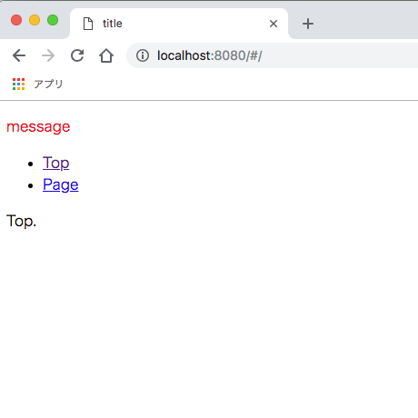
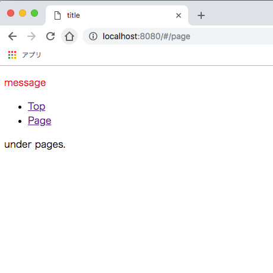
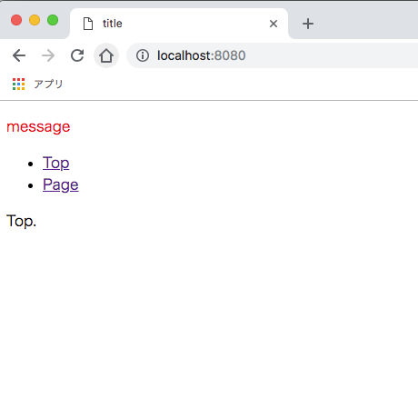
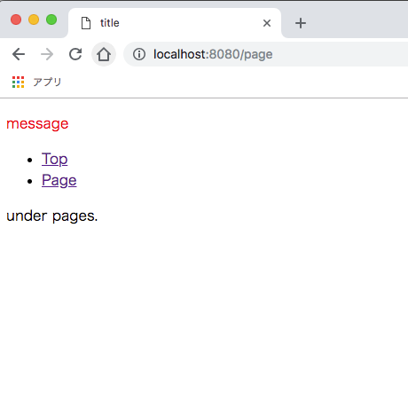
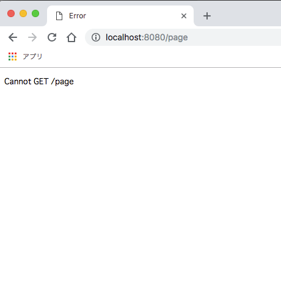
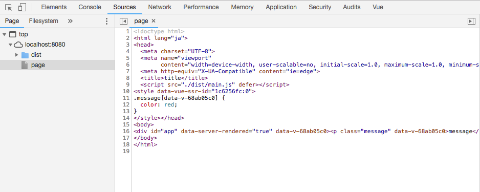

# 実践 - Vue.js SSR

この **実践 - Vue.js SSR** では、`Vue.js` + `Node.js(Express)`でSSR環境を構築していきます。  
自然な開発フローで、必要最低限の実装で進めていきます。  

## ゴール

**SSR環境を構築でき、拡張することができる**

- 極シンプルなSSR環境を構築します
- ジェネレータ的なものは使わず、全体の概要を理解しながら進めていきます

## 大まかな実装の流れ

1. ビルド環境
2. SPA
3. SSR

## 実践

はじめに、Node.jsがインストール済みであるか確認してください。  
ここでは現時点での安定板`v8.12.0`を使用していきます。  

続いて、任意のディレクトリで`npm init -y`を実行して`package.json`を生成しておきます。  

それではいきましょう。  

## 実践1. ビルド環境

`webpack`・`babel`を使用してESNextが書ける環境を構築します。

ビルド対象となるファイルを`src/index.js`として生成しておきましょう。  
確認用にESNextの`const`と`アロー関数`を使用します。  

**src/index.js**

```js
const greet = (message) => {
  console.log(message);
};

greet('Hello');
```

### `webpack`

`webpack`をインストールします。  

```bash
npm i -D webpack webpack-cli
```

`i`は`install`、`-D`は`--save-dev`のエイリアスです。  
以下のコマンドと同じ結果になります。  

```bash
npm install --save-dev webpack webpack-cli
```

続いて設定ファイルを作成します。  

`webpack.config.js`という名前のファイルを作成します。  
これは`webpack`が自動で読み込んでくれる特別な名前です。  

**webpack.config.js**

```js
const path = require('path');

const config = {
  entry: path.join(__dirname, 'src/index.js'),
  output: {
    filename: 'main.js',
    path: path.join(__dirname, 'dist')
  }
};

module.exports = (env, argv) => {
  switch (argv.mode) {
    case 'production':
      // expand config for production
      break;
    case 'development':
    default:
      // expand config for development
      config.devtool = 'inline-source-map';
      break;
  }

  return config;
};
```

ブロック毎に確認していきましょう。  

```js
  entry: path.join(__dirname, 'src/index.js'),
  output: {
    filename: 'main.js',
    path: path.join(__dirname, 'dist')
  }
```

`src/index.js`を`main.js`という名前で`dist`ディレクトリにビルドするだけの設定です。  

`require('path')`や`__dirname`はNode.jsで使える特別なモジュール・変数です。  
ここでは述べませんが、興味のある方は[Node.jsドキュメント](https://nodejs.org/ja/docs/)を参照してください。  

```js
module.exports = (env, argv) => {
  // ここで環境ごとの設定をする
  
  // 最後に設定内容を返すことを忘れずに
  return config;
}
```

`module.exports`では単にオブジェクトを返すこともできますが、関数を返すことによって実行時の環境（`env`）や引数（`argv`）を受け取ることができ、環境ごとの設定をすることが可能になります。  

```js
    case 'development':
    default:
      // expand config for development
      config.devtool = 'inline-source-map';
      break;
```

今回は開発環境でのみソースマップを追加するように設定しています。  

それでは、一度ビルドを実行してみましょう。  

```bash
npx webpack --mode=development
```

`npx`はローカルにインストールされているnode_modulesを実行できる、`npm`に付随する便利なコマンドです。  

以下のようなメッセージが表示され、`dist/main.js`というファイルが生成されれば成功です。  

```
Hash: c1504f90d90b13c36b96
Version: webpack 4.20.2
Time: 78ms
Built at: 2018-10-09 11:22:46
  Asset      Size  Chunks             Chunk Names
main.js  3.84 KiB    main  [emitted]  main
Entrypoint main = main.js
[./src/index.js] 72 bytes {main} [built]
```

`dist/main.js`を確認してみましょう。  
ファイル下部に以下のような記述が確認できます。  

```js
/***/ "./src/index.js":
/*!**********************!*\
  !*** ./src/index.js ***!
  \**********************/
/*! no static exports found */
/***/ (function(module, exports) {

const greet = (message) => {
  console.log(message);
};

greet('Hello');

/***/ })
```

`const`や`アロー関数`がそのままビルドされているのがわかります。  
まだESNextをコンパイルする設定をしていないため、これで問題ありません。  

今現在のディレクトリ構成を確認しておきます。

```
root
|- /dist
  |- main.js
|- /node_modules
  |- /some_modules
|- /src
  |- index.js
|- package.json
|- package-lock.json
|- webpack.config.js
```

ところで、ちらほら出現している`mode`とは何でしょうか。  

これは`webpack`にビルドの方法を指定するもので、`mode=production`とすれば本番環境に適した形でビルドをしてくれます。  
オプション`mode`を省略した場合、`webpack`は自動で`mode`を`production`に設定し、その旨のWARNINGをコマンドライン上に表示します。  

試しに以下のコマンドの実行して、コマンドライン上の表示やビルド結果の違いを確認してみてください。  

```bash
npx webpack
```

ここまでの実践内容で不明な点があった、また`webpack`についてより詳しく知りたい場合は[公式ガイド](https://webpack.js.org/guides/)を参照してください。  

### `babel`

`babel`を使用してESNextをコンパイルする設定をしていきましょう。  

必要パッケージをインストールします。  

```bash
npm i -D babel-loader @babel/core @babel/preset-env
```

続いて`babel`の設定を行います。  
`babel`の設定方法は[いくつか](https://babeljs.io/docs/en/configuration)ありますが、ここでは設定ファイル`.babelrc`を作っていきます。  

**.babelrc**

```json
{
  "presets": [
    [
      "@babel/preset-env",
      {
        "targets": {
          "browsers": ["> 1%", "last 2 versions", "not ie <= 8"]
        }
      }
    ]
  ]
}
```

この設定によって、`browsers`で指定した環境でもJavaScriptが動作するようにコンパイルされます。  
なお、設定値は[vuejs-templates](https://github.com/vuejs-templates)を参照しています。  

次に`webpack`で`babel`を使うように、`webpack.config.js`に追記します。  

**webpack.config.js**

```js
const path = require('path');

const config = {
  entry: path.join(__dirname, 'src/index.js'),
  output: {
    filename: 'main.js',
    path: path.join(__dirname, 'dist')
  },
  
  // 以下を追加
  module: {
    rules: [
      {
        test: /\.m?js$/,
        exclude: /node_modules/,
        loader: 'babel-loader'
      }
    ]
  }
};
```

これで拡張子`.mjs`または`.js`のビルドには`babel`の設定が適応されます。  

それでは、ビルドを実行してみましょう。  

```bash
npx webpack --mode=development
```

`dist/main.js`のファイル下部を見てみます。  

```js
/***/ "./src/index.js":
/*!**********************!*\
  !*** ./src/index.js ***!
  \**********************/
/*! no static exports found */
/***/ (function(module, exports) {

var greet = function greet(message) {
  console.log(message);
};

greet('Hello');

/***/ })
```

`const`が`var`に、`(message) => { ... }`が`function greet(message) { ... }`に変換されています。  
これでESNextが書ける環境が整いました。  

`babel`の機能や`babel-loader`の設定について、より詳しく知りたい場合は以下を参照してください。  

- [BABELドキュメント](https://babeljs.io/docs/en/index.html)
- [babel-loader on GitHub](https://github.com/babel/babel-loader)

最後に、ビルドコマンドをnpm scriptsに登録しておきましょう。  
`package.json`の`scripts`に以下を追記します。  

**package.json**

```js
{
  ...,
  "scripts": {
    "test": "echo \"Error: no test specified\" && exit 1",
    
    // 以下を追加
    "build:prod": "webpack -p",
    "build:dev": "webpack --mode=development"
  },
  ...
}
```

npm scriptsでは`npx`なしでもローカルにインストールされたnode_modulesの実行が可能です。  

`webpack`にオプション`-p`を指定すると、自動的に`production`モードに設定され、コード圧縮も実行されます。  

以下のコマンドを実行して、それぞれのビルド結果の違いを確認してみてください。  

```bash
# 本番用
npm run build:prod

# 開発用
npm run build:dev
```

現在のディレクトリ構成は以下のようになっています。

```
root
|- /dist
  |- main.js
|- /node_modules
  |- /some_modules
|- /src
  |- index.js
|- .babelrc
|- package.json
|- package-lock.json
|- webpack.config.js
```

## 実践2. SPA

Vue.jsで簡単なSPAを作っていきます。  

### 単一ファイルコンポーネント

単一ファイルコンポーネント（`.vue`）を使えるようにしていきましょう。  

必要パッケージをインストールします。  

```bash
npm i -S vue
```

```bash
npm i -D vue-loader
```

`vue`はブラウザ上で使用するため、`--save`のエイリアス`-S`でインストールしておきます。

まずはブラウザ上で動かすコードから書いていきます。  

`vue`を動かせるように`index.html`を作ります。  
重要なのは  

① ビルド結果の`dist/main.js`を読み込むこと  
② マウント先となる空div`<div id="app"></div>`を置くこと  

です。  
また、`dist/main.js`は`DOMContentLoaded`後に走らせるように  

③ `script`タグに`defer`属性を追加  

しておきます。  

**index.html**

```html
<!doctype html>
<html lang="ja">
<head>
  <meta charset="UTF-8">
  <meta name="viewport"
        content="width=device-width, user-scalable=no, initial-scale=1.0, maximum-scale=1.0, minimum-scale=1.0">
  <meta http-equiv="X-UA-Compatible" content="ie=edge">
  <title>title</title>
  <!-- ①, ③ -->
  <script src="./dist/main.js" defer></script>
</head>
<body>
<!-- ② -->
<div id="app"></div>
</body>
</html>
```

`vue`を使用するように`src/index.js`を変更します。  
マウント先に`#app`を、レンダリングにコンポーネント`App.vue`を指定します。  

**src/index.js**

```js
import Vue from 'vue';
import App from './App.vue';

new Vue({
  el: '#app',
  render: h => h(App)
});
```

コンポーネント`App.vue`を作成します。

**src/App.vue**

```html
<template>
  <p>{{message}}</p>
</template>

<script>
  export default {
    data() {
      return {
        message: 'message'
      }
    }
  }
</script>
```

これでブラウザ上で`vue`を動かす準備が出来ました。  

次に単一ファイルコンポーネントをコンパイルできるように`webpack.config.js`を変更します。  

**webpack.config.js**

```js
const path = require('path');
const VueLoaderPlugin = require('vue-loader/lib/plugin');

const config = {
  entry: path.join(__dirname, 'src/index.js'),
  output: {
    filename: 'main.js',
    path: path.join(__dirname, 'dist')
  },
  module: {
    rules: [
      {
        test: /\.vue$/,
        loader: 'vue-loader'
      },
      {
        test: /\.m?js$/,
        exclude: /node_modules/,
        loader: 'babel-loader'
      }
    ]
  },
  plugins: [
    new VueLoaderPlugin()
  ]
};
```

ビルドしてブラウザで表示してみましょう。  

```bash
npm run build:dev
```

ローカルサーバーを任意の方法で立ち上げてください。  
macOSであれば以下のコマンドが利用できます。  

```bash
# プロジェクトルートにて
python -m SimpleHTTPServer 8000

# localhost:8000にアクセス可能
# Ctrl + c で終了
```

「message」という文字列が表示されていれば成功です。  


コンポーネント内でcssも書けるようにしておきましょう。  
`src/App.vue`にcssを追加します。  

**src/App.vue**

```html
<template>
  <p class="message">{{message}}</p>
</template>

...

<style>
  .message {
    color: red;
  }
</style>
```

必要パッケージをインストールし、`webpack.config.js`にルールを追加します。  

```bash
npm i -D vue-style-loader css-loader
```

**webpack.config.js**

```js
  module: {
    rules: [
      {
        test: /\.vue$/,
        loader: 'vue-loader'
      },
      {
        test: /\.m?js$/,
        exclude: /node_modules/,
        loader: 'babel-loader'
      },
      
      // 以下を追加
      {
        test: /\.css$/,
        use: [
          'vue-style-loader',
          'css-loader'
        ]
      }
    ]
  },
```

再度ビルド、（閉じていれば）ローカルサーバーを立ち上げて表示してみましょう。  
先ほどの「message」が赤くなっていれば成功です。  


`vue`で出来ることや`vue-loader`の設定について、より詳しく知りたい場合は以下を参照してください。  

- [Vue.jsガイド](https://jp.vuejs.org/v2/guide/)
- [Vue Loaderガイド](https://vue-loader.vuejs.org/guide/)

現在のディレクトリ構成は以下のようになっています。

```
root
|- /dist
  |- main.js
|- /node_modules
  |- /some_modules
|- /src
  |- App.vue
  |- index.js
|- .babelrc
|- index.html
|- package.json
|- package-lock.json
|- webpack.config.js
```

### ルーティング

`vue-router`でルーティングを行い、SPAにしていきます。  

必要パッケージをインストールします。  

```bash
npm i -S vue-router
```

`src/router.js`を作成し、ルーティングの設定をします。  

**src/router.js**

```js
import Vue from 'vue';
import Router from 'vue-router';
import Top from './components/Top.vue';
import Page from './components/Page.vue';

Vue.use(Router);

const routes = [
  { path: '/', component: Top },
  { path: '/page', component: Page }
];

const router = new Router({ routes });

export default router;
```

パス`/`ではコンポーネント`Top.vue`を、パス`/page`ではコンポーネント`Page.vue`をレンダリングします。  
それぞれのコンポーネントも作りましょう。  

**src/components/Top.vue**

```html
<template>
  <p>Top.</p>
</template>
```

**src/components/Page.vue**

```html
<template>
  <p>under pages.</p>
</template>
```

これらを有効化させるために、`src/index.js`で`router`を読み込みます。  

**src/index.js**

```js
import Vue from 'vue';
import App from './App.vue';
import router from './router';

new Vue({
  el: '#app',
  router,
  render: h => h(App)
});
```

`src/App.vue`にリンクと表示の設定を行います。  

```html
<template>
  <div>
    <p class="message">{{message}}</p>
    <ul>
      <li><router-link to="/">Top</router-link></li>
      <li><router-link to="/page">Page</router-link></li>
    </ul>
    <router-view></router-view>
  </div>
</template>

...
```

パスが変わると`<router-view></router-view>`の内容が対応するコンポーネントに変わる構成です。  

ビルドして表示を確認してみましょう。  


URLとコンテンツが変わっても、画面の再読み込みは行われません。  
とても簡単ですが、これでSPAができました。  

`vue-router`についてより詳しく知りたい場合は[公式ガイド](https://router.vuejs.org/ja/guide/)を参照してください。

現在のディレクトリ構成は以下のようになっています。

```
root
|- /dist
  |- main.js
|- /node_modules
  |- /some_modules
|- /src
  |- /components
    |- Page.vue
    |- Top.vue
  |- App.vue
  |- index.js
  |- router.js
|- .babelrc
|- index.html
|- package.json
|- package-lock.json
|- webpack.config.js
```

## 実践3. SSR

サーバーとSSRを実装していきます。  

### サーバー

Node.jsとフレームワーク`Express`を使用してサーバーを実装していきます。  

必要パッケージをインストールします。  

```bash
npm i -S express
```

`app.js`を作成し、サーバーのコードを書いていきます。  

**app.js**

```js
const express = require('express');

const app = express();
app.use('/', express.static('public'));
app.use('/dist', express.static('dist'));

app.listen(8080);
```

これにより`localhost:8080`にアクセスできるようになります。  
また、ディレクトリ`public`に配置したファイルはパス`/{fileName}`で、ディレクトリ`dist`に配置したファイルはパス`/dist/{fileName}`でアクセスが可能になります。  

では、ディレクトリ`public`を作成し`index.html`をそこに移動しましょう。  
続いてスクリプトの読み込みパスをルートパスに変更します。  

**public/index.html**

```html
<head>
  ...
  <script src="/dist/main.js" defer></script>
</head>
```

サーバーを実行しましょう。  
サーバーの実行には`node`コマンドを使用します。  

```bash
node app
```

`node`コマンドでは拡張子`.js`を省略できます。  
上のコマンドは次のコマンドと同じ結果になります。

```bash
node ./app.js
```

`localhost:8080`にアクセスし、次のように表示されれば成功です。  



サーバーの実行コマンドをnpm scriptsに登録しておきましょう。  

現在起動中のサーバーを`ctrl` + `c`で終了します。  
`package.json`の`scripts`に以下を追記します。  

**package.json**

```js
{
  ...,
  "scripts": {
    "test": "echo \"Error: no test specified\" && exit 1",
    
    // 以下を追加
    "start": "node app",
    
    "build:prod": "webpack -p",
    "build:dev": "webpack --mode=development"
  },
  ...
}
```

`start`は特別なscriptで、`npm start`で実行が可能です。  
`ctrl` + `c`で終了します。  

現在のディレクトリ構成は以下のようになっています。

```
root
|- /dist
  |- main.js
|- /node_modules
  |- /some_modules
|- /public
  |- index.html
|- /src
  |- /components
    |- Page.vue
    |- Top.vue
  |- App.vue
  |- index.js
  |- router.js
|- .babelrc
|- app.js
|- package.json
|- package-lock.json
|- webpack.config.js
```

### SSR

いよいよSSRの実装に入ります。  

はじめに完成形をイメージしましょう。  

現在は`vue-router`をモード`hash`に設定しています。  
URLに`/#/`が付くのはこのためです。  

モード`hash`では下層ページにも直接アクセスが可能です。  
`npm start`でサーバーを立ち上げ、`localhost:8080/#/page`に直接アクセスしてみましょう。  



問題なく表示されます。  

次にモード`history`に変更します。  
`src/router.js`に設定を追加します。  

**src/router.js**

```js
...
const router = new Router({
  mode: 'history',
  routes
});
```

ビルドし、サーバーを起動後、`localhost:8080`にアクセスしてみましょう（`/page`ではありません）。  



URLに`/#/`が付きません。  

トップからアクセスした場合、下層ページへもアクセスが可能です。  
リンクをクリックして動作を確認してみてください。  



では、`localhost:8080/page`に直接アクセスしてみましょう。  



モード`hash`の時とは違い、エラーになります。  

SSRを行うことでこれを正常に表示させ、またSPAのコンテンツ切り替えを可能にしていきます。  

#### パッケージインストール

必要パッケージをインストールします。  

```bash
npm i -S vue-template-compiler
```

パッケージ`vue`と`vue-template-compiler`は同じバージョンである必要があります。  
`package.json`でそれぞれのバージョンを確認しておきましょう。  

```js
...,
  "dependencies": {
    ...,
    "vue": "^2.5.17",
    "vue-template-compiler": "^2.5.17",
    ...
```

#### webpackの分割

SSRでは、クラアントとサーバーでそれぞれvueをコンパイルする必要があります。  
そのために`webpack.config.js`を以下の３つに分割していきます。  

- `webpack.base.config.js`
- `webpack.client.config.js`
- `webpack.server.config.js`

**webpack.base.config.js**

```js
const path = require('path');
const VueLoaderPlugin = require('vue-loader/lib/plugin');

const config = {
  entry: path.join(__dirname, 'src/entry-client.js'),
  output: {
    filename: 'main.js',
    path: path.join(__dirname, 'dist')
  },
  module: {
    rules: [
      {
        test: /\.vue$/,
        loader: 'vue-loader'
      },
      {
        test: /\.m?js$/,
        exclude: /node_modules/,
        loader: 'babel-loader'
      },
      {
        test: /\.css$/,
        use: [
          'vue-style-loader',
          'css-loader'
        ]
      }
    ]
  },
  plugins: [
    new VueLoaderPlugin()
  ]
};

module.exports = config;
```

元の`webpack.config.js`を基準とするため、内容は同じです。  
この後でエントリーファイルもクライアントとサーバー用に分割していくため、`entry`の設定が若干変わっています。  
ソースマップの設定部分は次の`webpack.client.config.js`に移動します。  

**webpack.client.config.js**

```js
const baseConfig = require('./webpack.base.config');

const config = { ...baseConfig };

module.exports = (env, argv) => {
  switch (argv.mode) {
    case 'production':
      // expand config for production
      break;
    case 'development':
    default:
      // expand config for development
      config.devtool = 'inline-source-map';
      break;
  }

  return config;
};
```

`webpack.base.config.js`の読み込みと、元の`webpack.config.js`にあったソースマップの設定を切り出したのみで、新たな記述はありません。  

**webpack.server.config.js**

```js
const path = require('path');
const VueSSRServerPlugin = require('vue-server-renderer/server-plugin');
const baseConfig = require('./webpack.base.config');

const config = {
  ...baseConfig,
  entry: path.join(__dirname, 'src/entry-server.js'),
  target: 'node',
  output: {
    ...baseConfig.output,
    libraryTarget: 'commonjs2'
  },
  plugins: [
    ...baseConfig.plugins,
    new VueSSRServerPlugin()
  ]
};

module.exports = config;
```

`webpack.base.config.js`の内容をサーバー用に上書きしています。  
設定内容について詳しく知りたい場合は[Vue SSR ガイド：ビルド設定](https://ssr.vuejs.org/ja/guide/build-config.html#server-%E8%A8%AD%E5%AE%9A)を参照してください。  

#### エントリーファイルの分割

エントリーファイルをクライアントとサーバー用に分割していきます。  
`src/index.js`を以下の３つに分割していきます。  

- `src/entry-base.js`
- `src/entry-client.js`
- `src/entry-server.js`

また、この過程で`src/router.js`にも変更を加えます。  

**src/entry-base.js**

```js
import Vue from 'vue';
import App from './App.vue';
import { createRouter } from './router';

const createApp = () => {
  const router = createRouter();

  const app = new Vue({
    router,
    render: h => h(App)
  });

  return { app, router };
};

export { createApp };
```

単にVueインスタンスを返すのではなく、Vueインスタンスを生成するための関数を返しています。  
これはサーバーではリクエストごとにVueインスタンスを生成する必要があるためです。  

同様に`src/router.js`もRouterインスタンスを生成する関数を返すように変更します。  

**src/router.js**

```js
import Vue from 'vue';
import Router from 'vue-router';
import Top from './components/Top.vue';
import Page from './components/Page.vue';

Vue.use(Router);

const routes = [
  { path: '/', component: Top },
  { path: '/page', component: Page }
];

const createRouter = () => {
  return new Router({
    mode: 'history',
    routes
  });
};

export { createRouter };
```

**src/entry-client.js**

```js
import { createApp } from './entry-base';

const { app } = createApp();
app.$mount('#app');
```

クライアントではVueインスタンスを生成し`#app`にマウントするのみです。  

**src/entry-server.js**

```js
import { createApp } from './entry-base';

export default ctx => {
  return new Promise((resolve, reject) => {
    const { app, router } = createApp();
    router.push(ctx.url);

    const matchedComponents = router.getMatchedComponents();
    if (!matchedComponents) return reject({ code: 404 });
    resolve(app);
  });
}
```

リクエストに対するルーティングを解決し、エラーまたはアプリケーションインスタンスを返します。  

この設定は以下の公式ドキュメントを参考に、必要な部分のみを設定しています。  

- [Vue SSR ガイド：ソースコードの構成](https://ssr.vuejs.org/ja/guide/structure.html#webpack%E3%81%AB%E3%82%88%E3%82%8B%E3%82%B3%E3%83%BC%E3%83%89%E6%A7%8B%E9%80%A0)
- [Vue SSR ガイド：ルーティングとコード分割](https://ssr.vuejs.org/ja/guide/routing.html#vue-router-%E3%81%AB%E3%82%88%E3%82%8B%E3%83%AB%E3%83%BC%E3%83%86%E3%82%A3%E3%83%B3%E3%82%B0)

#### ビルド

クライアント、サーバーそれぞれのビルドコマンドをnpm scriptsに登録しましょう。  
`package.json`の`scripts`を変更します。  

**package.json**

```js
{
  ...,
  "scripts": {
    "test": "echo \"Error: no test specified\" && exit 1",
    "start": "node app",
    
    // 以下を変更
    "build:prod": "webpack -p --config=webpack.client.config.js && webpack -p --config=webpack.server.config.js",
    "build:dev": "webpack --mode=development --config=webpack.client.config.js && webpack --mode=development --config=webpack.server.config.js"
  },
  ...
}
```

`webpack`コマンドに`--config`オプションで設定ファイルを指定しています。  
`&&`で２つのコマンドを繋いでいるため、１度のscript実行で２つのビルドが行われます。  

それではビルドを実行してみましょう。  

```bash
npm run build:dev
```

ディレクトリ`dist`に以下の２つのファイルが生成されれば成功です。  

- `main.js`
- `vue-ssr-server-bundle.json`

`vue-ssr-server-bundle.json`の`output`設定は行なっていませんが、プラグイン`new VueSSRServerPlugin()`によって生成されます。  

現在のディレクトリ構成は以下のようになっています。

```
root
|- /dist
  |- main.js
  |- vue-ssr-server-bundle.json
|- /node_modules
  |- /some_modules
|- /public
  |- index.html
|- /src
  |- /components
    |- Page.vue
    |- Top.vue
  |- App.vue
  |- entry-base.js
  |- entry-client.js
  |- entry-server.js
  |- router.js
|- .babelrc
|- app.js
|- package.json
|- package-lock.json
|- webpack.base.config.js
|- webpack.client.config.js
|- webpack.server.config.js
```

#### サーバー実装

サーバーでvueをレンダリングし、結果をhtmlとしてクライアントに返します。  

`app.js`を変更していきます。  

**app.js**

```js
const path = require('path');
const fs = require('fs');
const express = require('express');
const VueServerRenderer = require('vue-server-renderer');

const app = express();
app.use('/', express.static('public'));
app.use('/dist', express.static('dist'));

const template = fs.readFileSync(path.join(__dirname, 'src/index.template.html'), 'utf-8');
const renderer = VueServerRenderer.createBundleRenderer(path.join(__dirname, 'dist/vue-ssr-server-bundle.json'), { template });

app.get('*', (req, res) => {
  const ctx = { url: req.url };
  renderer.renderToString(ctx, (err, html) => {
    if (err) return res.status(500).end('Interval Server Error');
    res.end(html);
  });
});

app.listen(8080);
```

大きく分けて２つの追加を行なっています。  

```js
const path = require('path');
const fs = require('fs');
const express = require('express');
const VueServerRenderer = require('vue-server-renderer');

...

const template = fs.readFileSync(path.join(__dirname, 'src/index.template.html'), 'utf-8');
const renderer = VueServerRenderer.createBundleRenderer(path.join(__dirname, 'dist/vue-ssr-server-bundle.json'), { template });
```

必要モジュールの読み込みと、レンダーに使うテンプレートファイル`src/index.template.html`の読み込み、さらにレンダラにサーバー用にビルドしたファイル`dist/vue-ssr-server-bundle.json`のパスを渡しています。  
テンプレートファイル`src/index.template.html`はこの後で作っていきます。  

```js
app.get('*', (req, res) => {
  const ctx = { url: req.url };
  renderer.renderToString(ctx, (err, html) => {
    if (err) return res.status(500).end('Interval Server Error');
    res.end(html);
  });
});
```

`Express`のルーティング設定です。  
全てのパス（`*`）でルーティングを行い、対応するURL（`req.url`）でレンダリング、結果のhtmlをクライアントに返しています。  

続いて`src/index.template.html`を作っていきます。  
`public/index.html`をディレクトリ`src`に移動し、ファイル名を`index.template.html`に変更します。  
さらに１箇所だけコードを変更します。  

**src/index.template.html**

```html
...
<body>
<!--vue-ssr-outlet-->
</body>
```

`<div id="app"></div>`を`<!--vue-ssr-outlet-->`に変更しています。  
`<!--vue-ssr-outlet-->`がhtmlが挿入される箇所です。  

最後に、`src/App.vue`も１箇所だけ変更します。  

**src/App.vue**

```html
<template>
  <div id="app">
    ...
```

ルートの`div`要素に属性`id="app"`を追加しています。  

それでは、ビルド、サーバーを起動後、`localhost:8080/page`にアクセスしてみましょう。  

```bash
# せっかくなのでproductionでビルドしてみます
npm run build:prod

npm start

# localhost:8080/page にアクセス！
```

正常に表示されたら、ソースコードを確認してみましょう。  



`<div id="app" data-server-rendered="true" data-v-68ab05c0><p class="message" data-v-68ab05c0>message...`

おめでとうございます！  
無事にSSRを実装することができました！

クライアントではSPAとして動作するか、リンクをクリックして確認してみてください。  

最終的なディレクトリ構成は以下のようになっています。

```
root
|- /dist
  |- main.js
  |- vue-ssr-server-bundle.json
|- /node_modules
  |- /some_modules
|- /src
  |- /components
    |- Page.vue
    |- Top.vue
  |- App.vue
  |- entry-base.js
  |- entry-client.js
  |- entry-server.js
  |- index.template.html
  |- router.js
|- .babelrc
|- app.js
|- package.json
|- package-lock.json
|- webpack.base.config.js
|- webpack.client.config.js
|- webpack.server.config.js
```

## おわりに

今回は必要最低限のSSRを実装しましたが、やりたいことはまだまだあるでしょう。  

- サーバーからクライアントにデータを渡したい
- Vuexを使いたい
- ルーティングをしっかり行いたい
- パフォーマンスを上げたい
- etc...

また、ジェネレータで生成された環境の上に実装したいケースや、Nuxt.jsのSSR環境を拡張したい、といったこともあるでしょう。  

私もこれからこれらに挑戦していく予定ですが、基礎はすでに身につけたはずです。  
この基礎の上に新しい技術を積み重ね、更に発展させていくつもりです。  

次は → [Vue SSR ガイド](https://ssr.vuejs.org/ja/)
